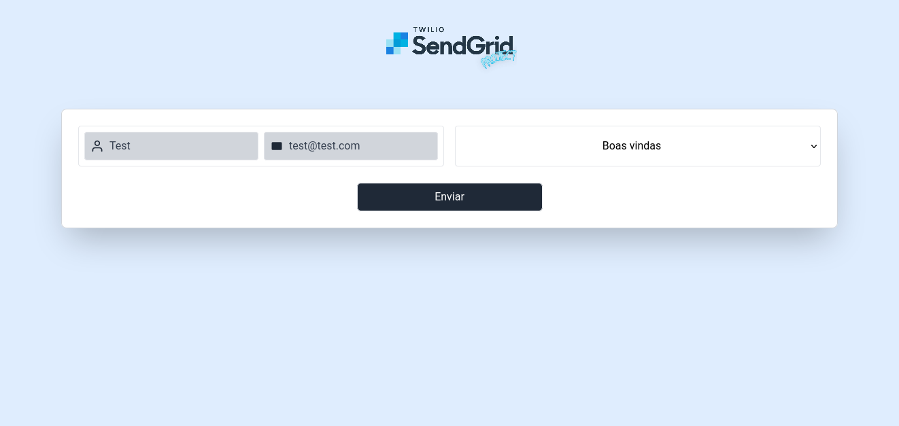

## SendGrid Project

> Envio de e-mails com templates pŕé-definidos.

### Brainstorm 

A ideia geral deste projeto de estudo é utilizar a biblioteca SendGrid para enviar por e-mail templates prontos para um destinatário, como felicitações em um dia de aniversário, um desejo de boas-vindas a um novo empregado, entre outros.

### Ferramentas

- Back-end:
  - SendGrid
  - Express
  - Cors
  - Joi
  - Lodash

- Front-end:
  - React Native
  - Tailwind

### Funcionamento:

No front-end disponibilizo um formulário para o usuário, onde ele deve informar o nome e o e-mail do destinatário e escolher entre os templates pré-definidos.

Estas três informações são coletadas pelo constructor no front-end que realiza um fetch POST no back-end, na rota /sendMail.

Quando o back-end recebe esta mensagem, ele realiza algumas ações:
      
      1. Valida utilizando Joi se os componentes da mensagem (destinatário, nome e template) existem e se encaixam no schema. Por exemplo: se o campo do e-mail for preenchido mas o e-mail for inválido - como a falta do @ - a mensagem como um todo é inválida, pois não há destinatário para envio do e-mail;
      2. Após validar estes três campos, as validações retornam a mensagem para o  controller que então realiza a tentativa de envio do e-mail através do service;
      3. O status do envio do e-mail é passado para uma nova validação, desta vez com lodash: caso este seja 202, o e-mail então foi enviado corretamente pelo SendGrid e é retornado para o controller o template de um body de um envio que obteve sucesso, caso contrário, é retornado o template de um body de um envio que falhou;
      4. Independente do template, é passado para o front-end que trata no response do fetch e imprime para o usuário através de um alert.

#### Screenshot:

